<p align="center">
  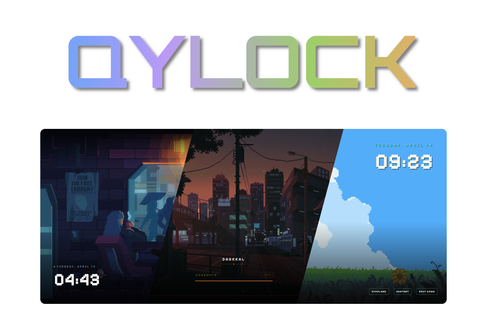
</p>

<p align="center">
  <a href="#sddm-setup"></a>&nbsp;<a href="#quickshell-setup"></a>&nbsp;<a href="https://github.com/Darkkal44/qylock/stargazers"></a>&nbsp;<a href="https://github.com/Darkkal44/qylock"></a>
</p>

<div align="center">
<pre>
<a href="#sddm-setup">ꜱᴅᴅᴍ</a>  •  <a href="#quickshell-setup">ǫᴜɪᴄᴋsʜᴇʟʟ</a>  •  <a href="#faq">ꜰᴀǫ</a>  •  <a href="#gallery">ɢᴀʟʟᴇʀʏ</a>  •  <a href="#acknowledgements">ᴀᴄᴋɴᴏᴡʟᴇᴅɢᴇᴍᴇɴᴛꜱ</a>  •  <a href="#credits">ᴄʀᴇᴅɪᴛꜱ</a>
</pre>
</div>

<br>

<p align="center">
  
</p>

<p>Welcome to <b>Qylock</b>! Pretty much a bunch of lockscreen themes I've put together for SDDM and Quickshell. I've always loved the "cozy" and minimalist vibe, so I've tried to keep everything looking clean~ </p>

<p><i>Hope ya find something that fits your setup! Thanks for stopping by!!</i></p>
<br>

> [!IMPORTANT]
> Have a problem? Please check the [FAQ](#faq) thoroughly before opening a new issue. Most common setup errors are already documented there!

<br>

<br>
<p align="center">━━━━━━━ ❖ ━━━━━━━</p>

<a id="sddm-setup"></a>
<br>

<p align="center">
  
</p>
<br>

Start by installing these dependencies using the package manager of your distro. (Note: Names might vary depending on your distribution.)

#### 📦 DEPENDENCIES

| | Packages |
|--:|:---|
| **Core** | `sddm` `qt6-declarative` `qt6-5compat` `qt6-svg` |
| **Video** | `qt6-multimedia` `qt6-multimedia-ffmpeg` |
| **GStreamer** | `gst-plugins-base` `gst-plugins-good` `gst-plugins-bad` `gst-plugins-ugly` |
| **Optional** | `fzf` |

<details>
<summary><b>View Font Requirements</b></summary>
<br>

Some themes rely on fonts that cannot be bundled here (copyright issues). Download the font and drop it into `themes/<theme_name>/font/` — it loads automatically.

| Theme | Font | Filename |
|--:|:---|:---|
| NieR: Automata | FOT-Rodin Pro DB | `FOT-Rodin Pro DB.otf` |
| Terraria | Andy Bold | `Andy Bold.ttf` |
| Genshin Impact | HYWenHei-85W | `zhcn.ttf` |
| Sword | The Last Shuriken | `The Last Shuriken.ttf` |
| Minecraft | Minecraft Regular | `minecraft.ttf` |
| Honkai: Star Rail | DIN Next | `font.ttf` |
| osu! | Torus Regular | `Torus Regular.otf` |

</details>

<br>

#### 🚀 INSTALLATION

> [!TIP]
> Don't want to install everything manually? Running the script below will handle the installation and configuration for you!

```sh
chmod +x sddm.sh && ./sddm.sh
```

<br>
<p align="center">━━━━━━━ ❖ ━━━━━━━</p>

<a id="quickshell-setup"></a>
<br>

<p align="center">
  
</p>

<br>

Start by installing these dependencies using the package manager of your distro. (Note: Names might vary depending on your distribution.)
#### 📦 DEPENDENCIES

| | Packages |
|--:|:---|
| **Core** | `quickshell` `qt6-declarative` `qt6-5compat` |
| **Video** | `qt6-multimedia` `qt6-multimedia-ffmpeg` |
| **GStreamer** | `gst-plugins-base` `gst-plugins-good` `gst-plugins-bad` `gst-plugins-ugly` |
| **Optional** | `fzf` |

<br>

#### 🚀 INSTALLATION

```sh
chmod +x quickshell.sh && ./quickshell.sh
```


<br>

#### ⌨️ SHORTCUT BINDING

Point your Window Manager keybind (e.g., in Hyprland, Qtile, Sway, or i3) directly to:

```sh
~/.local/share/quickshell-lockscreen/lock.sh
```

<br>


<p align="center">━━━━━━━ ◈ ━━━━━━━</p>

<a id="faq"></a>
<br>

<p align="center">
  
</p>

<br>

> [!TIP]
> Can't find your issue here? Feel free to open a discussion or an issue, but please double-check the sections below first!

<br>

#### ⌨️ Virtual Keyboard popping up?
If the virtual keyboard keeps opening on its own at startup, you can disable it in your SDDM config:

1. Open `/etc/sddm.conf.d/virtualkeyboard.conf` as root.
2. Under the `[General]` section, set `InputMethod` to empty:

```ini
[General]
InputMethod=
```

<br>

#### 📺 Low quality background video?
To keep the download size small, some videos are compressed. For the full 4K/HD version:
1. Get the original video from the links in the [Acknowledgements](#acknowledgements) section.
2. Rename it to `bg.mp4`.
3. Replace the `bg.mp4` inside your current theme's folder.

<br>

#### 🛠️ Themes not loading (library import version error)?
> [!NOTE]
> This error typically occurs because many stable distributions (like Debian or older Fedora versions) still use the **Qt5-based** version of SDDM. Since these themes are written in native Qt6 for modern systems, they require a specific transpilation step to work on legacy backends.

If you encounter library errors at the login screen:
1. Re-run the installation script: `./sddm.sh`.
2. When prompted, select the **Qt5 (Legacy)** option.
3. The script will automatically convert the themes and install the compatible versions for you.

| | Required Packages (Qt5 Legacy Mode) |
|--:|:---|
| **Core** | `sddm` `qt5-declarative` `qt5-graphicaleffects` `qt5-quickcontrols2` |
| **Video**| `qt5-multimedia` `gst-plugins-base` `gst-plugins-good` `gst-plugins-bad` `gst-plugins-ugly` |
| **Tools**| `perl` |

<br>

#### ❄️ Quickshell not working on KDE Plasma?
> [!NOTE]
> This is a known limitation of KWin. You can still use the SDDM portion of the themes for your login screen, but the Quickshell lockscreen itself is a no-go on Plasma because it lacks support for the `ext-session-lock-v1` protocol.

<br>

<p align="center">━━━━━━━ ❖ ━━━━━━━</p>

<a id="gallery"></a>
<br>

<p align="center">
  
</p>

<br>

<div align="center">
  <table style="border-collapse: collapse; border: none;">
    <tr>
      <td align="center" width="50%" style="padding: 15px; border: none;">
        <b>Pixel · Coffee</b><br><br>
        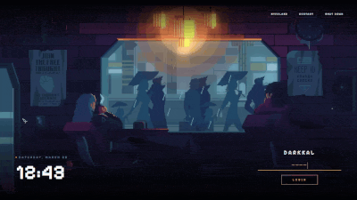
      </td>
      <td align="center" width="50%" style="padding: 15px; border: none;">
        <b>Pixel · Dusk City</b><br><br>
        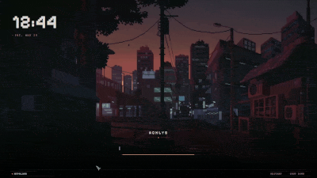
      </td>
    </tr>
    <tr>
      <td align="center" width="50%" style="padding: 15px; border: none;">
        <b>Pixel · Hollow Knight</b><br><br>
        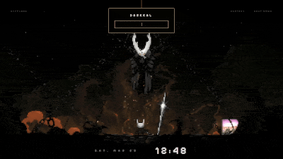
      </td>
      <td align="center" width="50%" style="padding: 15px; border: none;">
        <b>Pixel · Munchlax</b><br><br>
        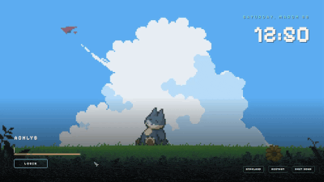
      </td>
    </tr>
    <tr>
      <td align="center" width="50%" style="padding: 15px; border: none;">
        <b>Pixel · Night City</b><br><br>
        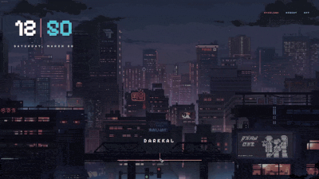
      </td>
      <td align="center" width="50%" style="padding: 15px; border: none;">
        <b>Pixel · Rainy Room</b><br><br>
        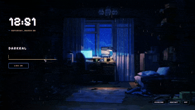
      </td>
    </tr>
    <tr>
      <td align="center" width="50%" style="padding: 15px; border: none;">
        <b>Pixel · Skyscrapers</b><br><br>
        
      </td>
      <td align="center" width="50%" style="padding: 15px; border: none;">
        <b>Enfield</b><br><br>
        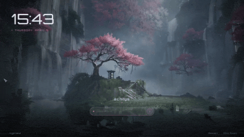
      </td>
    </tr>
    <tr>
      <td align="center" width="50%" style="padding: 15px; border: none;">
        <b>Sword</b><br><br>
        
      </td>
      <td align="center" width="50%" style="padding: 15px; border: none;">
        <b>Forest</b><br><br>
        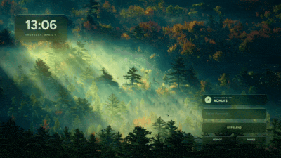
      </td>
    </tr>
    <tr>
      <td align="center" width="50%" style="padding: 15px; border: none;">
        <b>Winter</b><br><br>
        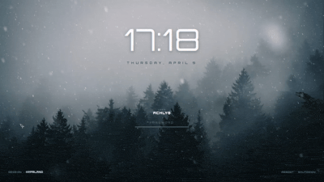
      </td>
      <td align="center" width="50%" style="padding: 15px; border: none;">
        <b>Dog Samurai</b><br><br>
        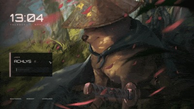
      </td>
    </tr>
    <tr>
      <td align="center" width="50%" style="padding: 15px; border: none;">
        <b>The Last of Us</b><br><br>
        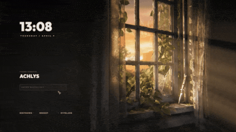
      </td>
      <td align="center" width="50%" style="padding: 15px; border: none;">
        <b>Honkai: Star Rail</b><br><br>
        
      </td>
    </tr>
    <tr>
      <td align="center" width="50%" style="padding: 15px; border: none;">
        <b>Genshin Impact</b><br><br>
        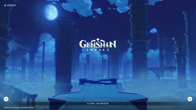
      </td>
      <td align="center" width="50%" style="padding: 15px; border: none;">
        <b>Wuthering Waves</b><br><br>
        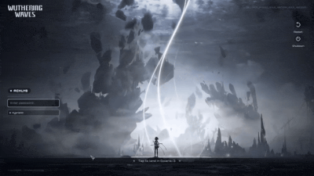
      </td>
    </tr>
    <tr>
      <td align="center" width="50%" style="padding: 15px; border: none;">
        <b>osu!</b><br><br>
        
      </td>
      <td align="center" width="50%" style="padding: 15px; border: none;">
        <b>Minecraft</b><br><br>
        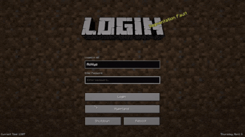
      </td>
    </tr>
    <tr>
      <td align="center" width="50%" style="padding: 15px; border: none;">
        <b>NieR: Automata</b><br><br>
        
      </td>      
      <td align="center" width="50%" style="padding: 15px; border: none;">
        <b>Reverse: 1999 - I</b><br><br>
        
      </td>
    </tr>
    <tr>
      <td align="center" width="50%" style="padding: 15px; border: none;">
        <b>Reverse: 1999 - II</b><br><br>
        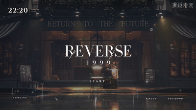
      </td>
      <td align="center" width="50%" style="padding: 15px; border: none;">
        <b>Clockwork</b><br><br>
        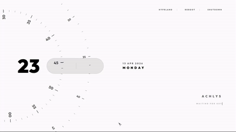
      </td>
    </tr>
    <tr>
      <td align="center" width="50%" style="padding: 15px; border: none;">
        <b>Terraria</b><br><br>
        
      </td>
      <td align="center" width="50%" style="padding: 15px; border: none;">
        <b>Ninja Gaiden</b><br><br>
        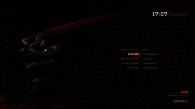
      </td>
    </tr>
    <tr>
      <td align="center" width="50%" style="padding: 15px; border: none;">
        <b>Windows 7</b><br><br>
        
      </td>
      <td align="center" width="50%" style="padding: 15px; border: none;">
      </td>
    </tr>
  </table>
</div>


<br>

<p align="center">━━━━━━━ ❖ ━━━━━━━</p>

<a id="acknowledgements"></a>
<br>

<p align="center">
  
</p>

<br>

Huge thanks to all the amazing artists for these wallpapers and fonts! Here's where everything comes from:

| Theme | Wallpaper | Font | Theme | Wallpaper | Font |
|:---|:---|:---|:---|:---|:---|
| **Pixel · Coffee** | [MoeWalls](https://moewalls.com/pixel-art/cyberpunk-coffee-pixel-live-wallpaper/) | Pixelify Sans | **Winter** | [MoeWalls](https://moewalls.com/landscape/winter-forest-snow-live-wallpaper/) | Orbitron |
| **Pixel · Dusk City** | [WallsFlow](https://wallsflow.com/live-wallpapers/pixel-art/505-pixel-dusk-city-retro-anime-streets-live-wallpaper.html) | Pixelify Sans | **Dog Samurai** | [MoeWalls](https://moewalls.com/others/doge-samurai-crying-live-wallpaper/) | Orbitron |
| **Pixel · Hollow Knight** | [MoeWalls](https://moewalls.com/pixel-art/hollow-knight-3-live-wallpaper/) | Pixelify Sans | **The Last of Us** | [MoeWalls](https://moewalls.com/games/the-last-of-us-sunset-live-wallpaper/) | Outfit |
| **Pixel · Munchlax** | [MoeWalls](https://moewalls.com/pixel-art/munchlax-sleeping-on-the-field-pixel-live-wallpaper/) | Pixelify Sans | **Honkai: Star Rail** | [YouTube](https://www.youtube.com/watch?v=Pz7Tu25EyXI) | DIN Next |
| **Pixel · Night City** | [WallsFlow](https://wallsflow.com/live-wallpapers/pixel-art/400-night-city-pixel-art-cyberpunk-live-wallpaper.html) | Pixelify Sans | **Genshin Impact** | [YouTube](https://www.youtube.com/watch?v=XG3vTgitBLE) | HYWenHei |
| **Pixel · Rainy Room** | [MoeWalls](https://moewalls.com/pixel-art/pixel-room-rainy-night-live-wallpaper/) | Pixelify Sans | **Wuthering Waves** | [YouTube](https://www.youtube.com/watch?v=xKKqi1zLrZ4) | Orbitron |
| **Pixel · Skyscrapers** | [WallsFlow](https://wallsflow.com/live-wallpapers/pixel-art/61-pixel-city.html) | Pixelify Sans | **Minecraft** | [Minecraft Wiki](https://www.google.com/url?sa=t&source=web&rct=j&url=https%3A%2F%2Fminecraft.fandom.com%2Fwiki%2FBackground&ved=0CBkQjhxqFwoTCIC45qWs4pMDFQAAAAAdAAAAABAH&opi=89978449) | Minecraft |
| **Enfield** | [WallsFlow](https://wallsflow.com/live-wallpapers/games/777-arknights-endfield-sakura-sanctuary-live-wallpaper.html) | Orbitron | **NieR: Automata** | [Reddit](https://www.reddit.com/r/nier/comments/7nqcy7/the_final_nier_automata_title_screen_made_into/) | FOT-Rodin Pro DB |
| **Sword** | [WallsFlow](https://wallsflow.com/live-wallpapers/anime/761-silent-katana-forest-samurai-live-wallpaper.html) | The Last Shuriken | **Terraria** | [Terraria Forums](https://forums.terraria.org/index.php?threads/terraria-desktop-wallpapers.12644/) | Andy Bold |
| **Forest** | [MoeWalls](https://moewalls.com/landscape/in-the-early-morning-forest-live-wallpaper/) | Figtree | **osu!** | [Official](https://osu.ppy.sh) | Torus Regular |
| **Ninja Gaiden** | [Noisy Pixel](https://noisypixel.net/ninja-gaiden-4-wallpapers-art-team/) | Tektur | **Windows 7** | [WallpaperAccess](https://wallpaperaccess.com/windows-7-lock-screen) | Segoe UI |

<br>

<p align="center">━━━━━━━ ❖ ━━━━━━━</p>

<a id="credits"></a>
<br>

<p align="center">
  
</p>

<div align="center">

### 💖 SUPPORTERS
**[Max](https://ko-fi.com/B0B1UPVVB)**  •  **Chương Kính**  •  **MerhawiGhebrekal**  •  **Silenett**  •  **wawzi**  •  **franchecol**

<br>

### 🛠️ SPECIAL THANKS
**Pumphium**, **kaizky**, **DragonChicken**

</div>
<br>
<p align="center">━━━━━━━ ༓ ━━━━━━━</p>

<div align="center">
  <p><i>Make your login your own.</i></p>
  <a href="https://ko-fi.com/darkkal">
    
  </a>
</div>
